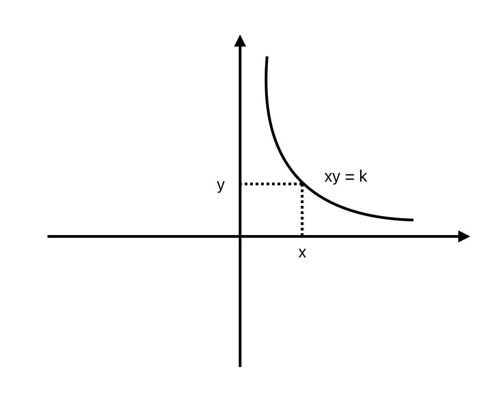
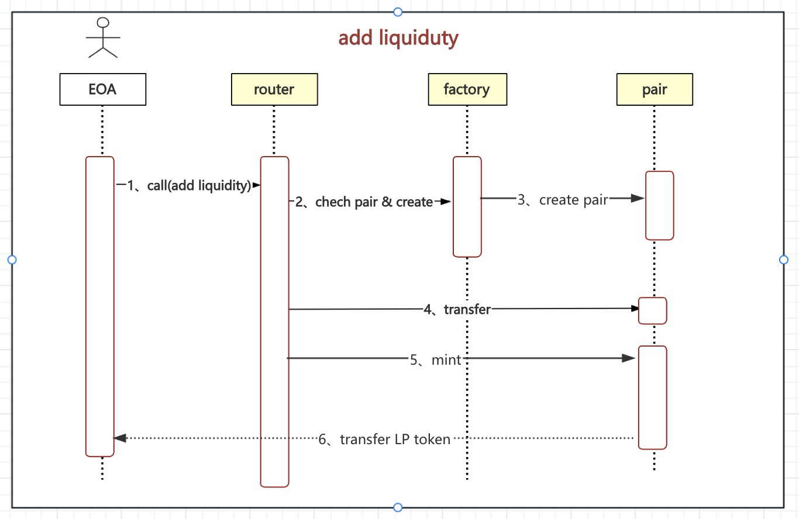
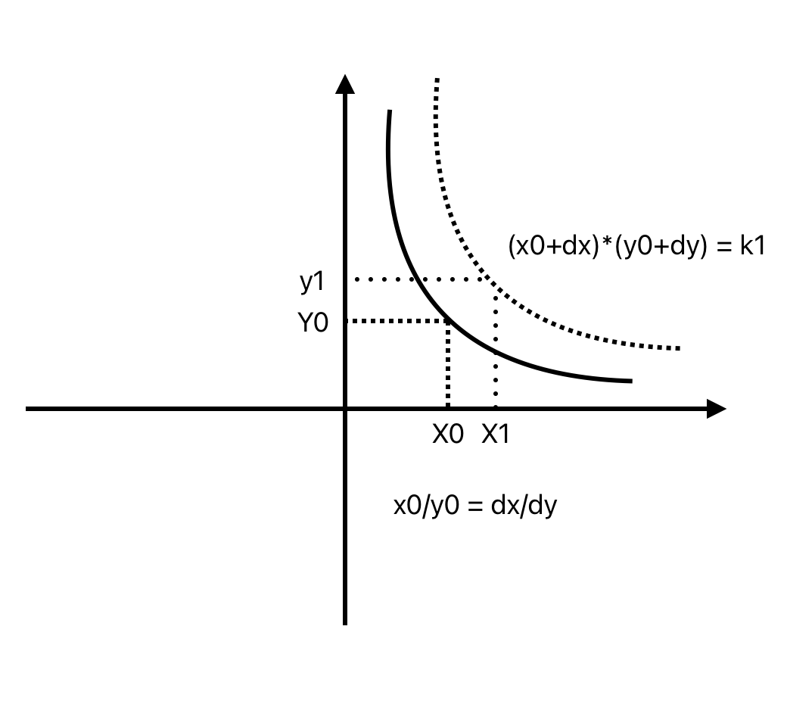
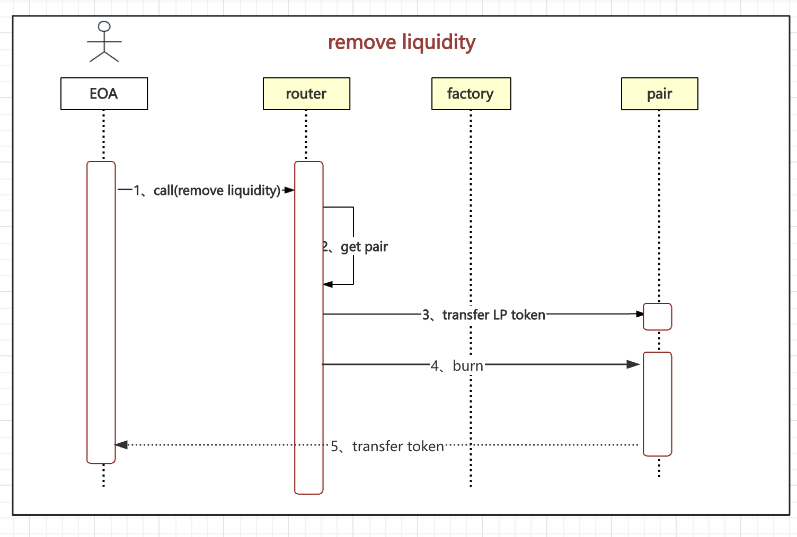
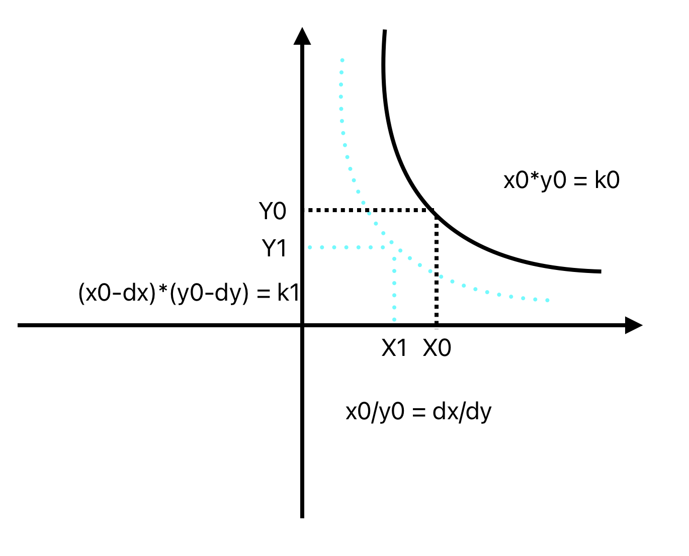
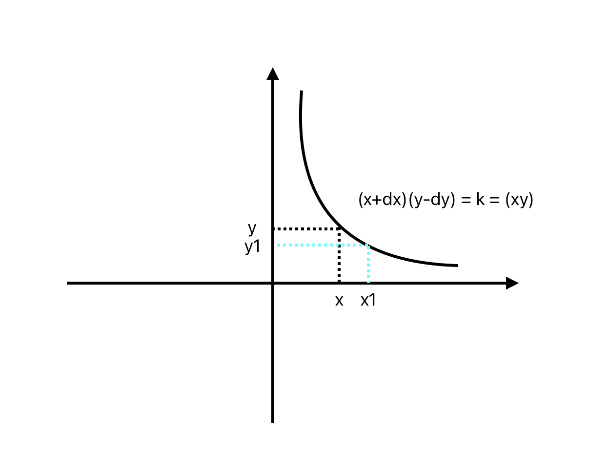

分析uniswap v2
---

### eth 合约地址
* `router` : `0x7a250d5630b4cf539739df2c5dacb4c659f2488d`
* `factory`: `0x5c69bee701ef814a2b6a3edd4b1652cb9cc5aa6f`

### [核心算法](https://docs.uniswap.org/whitepaper.pdf)
* 公式
$\large X * Y = K = L^2$

`X、Y`: 分别表示X代币和Y代币

`L`: 表示 LP token 的数量

* 矢量图
    

* [unsiwap v2 docs](https://docs.uniswap.org/contracts/v2/overview)

### 添加池子

* 添加池子的流程
    


* LP 的计算推导公式
    *  当添加流动性时的已知的三个条件
        *  添加前的liquidity token 的计算公式

            $\large L_{0} = \sqrt{\small x_{0} * y_{0}}$
        
        * 当有用户添加了 $d_{x}$ & $d_{y}$ 的数量时

            $\large L_{1} = \sqrt{\small(x_{0}+d_{x})(y_{0}+d_{y})}$
            
        * 按照流动性份额等比例原则,添加流动性时,要求按照当前池的比例提供代币,故

            $\frac{y_{0}}{x_{0}} = \frac{(y_{0} + d_{y})}{(x_{0} + d_{x})} = \frac{d_{y}}{d_{x}}$

            => $d_{x} = d_{y} * \frac{x_{0}}{y_{0}}$

            => $d_{y} = d_{x} * \frac{y_{0}}{x_{0}}$

    * 进入可以推导出如下公式(添加$d_{x}$ & $d_{y}$后 可以获得多少的LP token) 
        
        设: $d_{x}$ & $d_{y}$ 可以获取到 $\large S$ 个LP Token
            $\large T$ 为 total liquidity token (加池子之前)

        => $\large \frac{S}{T} = \frac{L_{1} - L_{0}}{L_{0}}$

        将 $d_{y} = d_{x} \frac{y_{0}}{x_{0}}$ 带入至 $L_{1}$

        => $L_{1} = \sqrt{(x_{0}+d_{x})(y_{0}+d_{x}\frac{y_{0}}{x_{0}})}$

        => $L_{1} = \sqrt{x_{0}y_{0} + d_{x}y_{0} + d_{x}y_{0} + d_{x}^2\frac{y_{0}}{x_{0}}}$

        => $L_{1} = \sqrt{x_{0}y_{0}(1 + 2\frac{d_{x}}{x_{0}} + \frac{d_{x}^2}{x_{0}^2})}$

        => $L_{1} = \sqrt{x_{0}y_{0}(1+\frac{d_{x}}{x_{0}})^2}$

        => $L_{1} = L_{0}(1 + \frac{d_{x}}{x_{0}})$

        => $S = \frac{L_{0}(1+\frac{d_{x}}{x_{0}}) - L_{0}}{L_{0}} * T$

        => $S = \frac{d_{x}}{x_{0}} * T$

        将 $d_{x} = d_{y} * \frac{x_{0}}{y_{0}}$ 带入至 S 中

        => $S = \frac{d_{y} * \frac{x_{0}}{y_{0}}}{x_0} * T$
        
        => $S = \frac{d_{y}}{y_{0}} *T = \frac{d_{x}}{x_{0}} * T$

    *  结论: ​新增的 LP Token 比例 = ​用户提供的代币比例
    
        $\frac{S}{T} = \frac{d_{y}}{y_{0}} = \frac{d_{x}}{x_{0}}$
    
* 矢量图


* 添加池子的代码解析
    * `pair`
        ```
         // this low-level function should be called from a contract which performs important safety checks
            function mint(address to) external lock returns (uint liquidity) {
                (uint112 _reserve0, uint112 _reserve1,) = getReserves(); // gas savings
                uint balance0 = IERC20(token0).balanceOf(address(this));
                uint balance1 = IERC20(token1).balanceOf(address(this));
                // 获取到 加入 支持的 token0 和 token 1 的 数量
                uint amount0 = balance0.sub(_reserve0);
                uint amount1 = balance1.sub(_reserve1);

                // _mintFee 看下面
                bool feeOn = _mintFee(_reserve0, _reserve1);
                uint _totalSupply = totalSupply; // gas savings, must be defined here since totalSupply can update in _mintFee

                if (_totalSupply == 0) {
                    // 初次添加 时 会减去10^3 , 方便后期撤池子后,任留有一点余额, 保证计算安全
                    liquidity = Math.sqrt(amount0.mul(amount1)).sub(MINIMUM_LIQUIDITY);
                _mint(address(0), MINIMUM_LIQUIDITY); // permanently lock the first MINIMUM_LIQUIDITY tokens
                } else {
                    // 这里S的计算,选择了其中小的那一个, 主要还是为了保证安全
                    liquidity = Math.min(amount0.mul(_totalSupply) / _reserve0, amount1.mul(_totalSupply) / _reserve1);
                }
                require(liquidity > 0, 'UniswapV2: INSUFFICIENT_LIQUIDITY_MINTED');

                // mint LP token
                _mint(to, liquidity);

                _update(balance0, balance1, _reserve0, _reserve1);
                // 更新k 
                if (feeOn) kLast = uint(reserve0).mul(reserve1); // reserve0 and reserve1 are up-to-date
                emit Mint(msg.sender, amount0, amount1);
            }
        ```

        * `router`
        ```
        function _addLiquidity(
            address tokenA,
            address tokenB,
            uint amountADesired,
            uint amountBDesired,
            uint amountAMin,
            uint amountBMin
        ) private returns (uint amountA, uint amountB) {
            // 检查池子是否存在
            if (IUniswapV2Factory(factory).getPair(tokenA, tokenB) == address(0)) {
                // 创建池子
                IUniswapV2Factory(factory).createPair(tokenA, tokenB);
            }
            // 获取当前池子的tokenA和tokenB的存储量
            (uint reserveA, uint reserveB) = UniswapV2Library.getReserves(factory, tokenA, tokenB);
            if (reserveA == 0 && reserveB == 0) {
                (amountA, amountB) = (amountADesired, amountBDesired);
            } else {
                // 根据用户 给定的tokenA 和tokenB 的数量, 来计算 当前如果给定tokenA 则需要多少tokenB 来加池子. 如果tokenB 不够,则根据tokenB 来计算tokenA 的数量. 进而得出用户能够加多少tokenA和tokenB进池子
                uint amountBOptimal = UniswapV2Library.quote(amountADesired, reserveA, reserveB);
                if (amountBOptimal <= amountBDesired) {
                    require(amountBOptimal >= amountBMin, 'UniswapV2Router: INSUFFICIENT_B_AMOUNT');
                    (amountA, amountB) = (amountADesired, amountBOptimal);
                } else {
                    uint amountAOptimal = UniswapV2Library.quote(amountBDesired, reserveB, reserveA);
                    assert(amountAOptimal <= amountADesired);
                    require(amountAOptimal >= amountAMin, 'UniswapV2Router: INSUFFICIENT_A_AMOUNT');
                    (amountA, amountB) = (amountAOptimal, amountBDesired);
                }
            }
        }
        ```

        ```
        function quote(uint amountA, uint reserveA, uint reserveB) internal pure returns (uint amountB) {
            require(amountA > 0, 'UniswapV2Library: INSUFFICIENT_AMOUNT');
            require(reserveA > 0 && reserveB > 0, 'UniswapV2Library: INSUFFICIENT_LIQUIDITY');

            // 加入池子的数量必须与储备量的比例相同
            // dy/dx = y0/x0
            // => dy = dx*(y0/x0)
            amountB = amountA.mul(reserveB) / reserveA;
        }
        ```

        ```
        function addLiquidity(
            address tokenA,
            address tokenB,
            uint amountADesired,
            uint amountBDesired,
            uint amountAMin,
            uint amountBMin,
            address to,
            uint deadline
        ) external override ensure(deadline) returns (uint amountA, uint amountB, uint liquidity) {
            // 得到用户提供的资金能够加入多少进池子
            (amountA, amountB) = _addLiquidity(tokenA, tokenB, amountADesired, amountBDesired, amountAMin, amountBMin);
            address pair = UniswapV2Library.pairFor(factory, tokenA, tokenB);
            // 转入池子
            TransferHelper.safeTransferFrom(tokenA, msg.sender, pair, amountA);
            TransferHelper.safeTransferFrom(tokenB, msg.sender, pair, amountB);
            // 调用pair 的mint 方法,获得LP token
            liquidity = IUniswapV2Pair(pair).mint(to);
        }
        function addLiquidityETH(
            address token,
            uint amountTokenDesired,
            uint amountTokenMin,
            uint amountETHMin,
            address to,
            uint deadline
        ) external override payable ensure(deadline) returns (uint amountToken, uint amountETH, uint liquidity) {
            // 得到用户提供的资金能够加入多少进池子
            (amountToken, amountETH) = _addLiquidity(
                token,
                WETH,
                amountTokenDesired,
                msg.value,
                amountTokenMin,
                amountETHMin
            );
            
            address pair = UniswapV2Library.pairFor(factory, token, WETH);
            // 将token 加入池子
            TransferHelper.safeTransferFrom(token, msg.sender, pair, amountToken);
            // eth 转WETH , pair 只支持erc20 token, 原生币需要转成wrapper eth. 转成weth 后, 加入池子
            IWETH(WETH).deposit{value: amountETH}();
            assert(IWETH(WETH).transfer(pair, amountETH));
            // 调用pair 的mint 方法,获得LP token
            liquidity = IUniswapV2Pair(pair).mint(to);
            // 剩余的eth 需要退还给用户
            if (msg.value > amountETH) TransferHelper.safeTransferETH(msg.sender, msg.value - amountETH); // refund dust eth, if any
        }
        ```
  
### 撤销池子
* 撤池子的流程
    

* 撤池子的推导公式
    * 当前已知的三个条件
      * 1、目前的liquidity token
        $L_{0} = \sqrt{x_0y_0}$
      * 2、撤销流动性后的liquidity token
        $L_{1} = \sqrt{(x_0 - d_x)(y_0 - d_y)}$
      * 3、流动性份额等比例原则
        $\frac{x_0}{y_0} = \frac{d_x}{d_y}$

        => $d_x = d_y \frac{x_0}{y_0}$

        => $d_y = d_x \frac{y_0}{y_0}$

    * 推导公式
        * 设: $S$ 为用户持有的LP token 数量. T为 当前池子中LP token 数量
          $\frac{S}{T} = \frac{L_0 - L_1}{L_0}$

          将 $d_y = d_x \frac{y_0}{x_0}$ 带入至 $L_1$

          => $L_1 = \sqrt{(x_0 - d_x)(y_0 - d_x\frac{y_0}{x_0})}$

          =>  $L_1 = \sqrt{x_0y_0 - 2d_xy_0+d_x^2\frac{y_0}{x_0}}$

          => $L_1 = \sqrt{x_0y_0(1 - 2\frac{d_x}{x_0} + \frac{d_x^2}{x_0^2})}$

          => $L_{1} = \sqrt{x_0y_0(1-\frac{d_x}{x_0})^2}$

          => $\frac{S}{T} = \frac{\sqrt{x_0y_0} - \sqrt{x_0y_0(1-\frac{d_x}{x_0})^2}}{\sqrt{x_0y_0}}$


          => $\frac{S}{T} = 1 - 1 - \frac{d_x}{x_0}$

          => $\frac{S}{T} = \frac{d_x}{x_0}$
          
          => $d_x = x_0 \frac{S}{T}$

          将 $d_x = d_y \frac{x_0}{y_0}$ 代入

          => $d_y \frac{x_0}{y_0} = x_0 \frac{S}{T} $

          => $d_y = y_0 \frac{S}{T}$

          故用户撤池子的时候,应该提取$d_x$$d_y$ 的数量分别如下
          $d_x = x_0 \frac{S}{T}$

          $d_y = y_0 \frac{S}{T}$

* 矢量图
    

* 撤池子的代码解析
    `pair`
    ```
    function burn(address to) external lock returns (uint amount0, uint amount1) {
        // 获取当前记录的token 储备量
        (uint112 _reserve0, uint112 _reserve1,) = getReserves(); // gas savings
        address _token0 = token0;                                // gas savings
        address _token1 = token1;                                // gas savings

        // 获取池子的balance 
        uint balance0 = IERC20(_token0).balanceOf(address(this));
        uint balance1 = IERC20(_token1).balanceOf(address(this));

        // 当前地址是不存储 LP token 的, 如果有LP token, 说明有人在做撤销池子, 需要把LP token 对应的token0 和token1 转给用户
        uint liquidity = balanceOf[address(this)];

        bool feeOn = _mintFee(_reserve0, _reserve1);
        uint _totalSupply = totalSupply; // gas savings, must be defined here since totalSupply can update in _mintFee
        // 计算出dx,dy 的 金额, 需转给用户 
        amount0 = liquidity.mul(balance0) / _totalSupply; // using balances ensures pro-rata distribution
        amount1 = liquidity.mul(balance1) / _totalSupply; // using balances ensures pro-rata distribution
        require(amount0 > 0 && amount1 > 0, 'UniswapV2: INSUFFICIENT_LIQUIDITY_BURNED');
        
        // 销毁当前地址的LP token 
        _burn(address(this), liquidity);

        // 转给用户
        _safeTransfer(_token0, to, amount0);
        _safeTransfer(_token1, to, amount1);
        // 转出后,得到新的池子数据,并更新
        balance0 = IERC20(_token0).balanceOf(address(this));
        balance1 = IERC20(_token1).balanceOf(address(this));

        // 更新池子的信息
        _update(balance0, balance1, _reserve0, _reserve1);
        if (feeOn) kLast = uint(reserve0).mul(reserve1); // reserve0 and reserve1 are up-to-date
        emit Burn(msg.sender, amount0, amount1, to);
    }
    ```

    `router`
    ```
    function removeLiquidity(
        address tokenA,
        address tokenB,
        uint liquidity,
        uint amountAMin,
        uint amountBMin,
        address to,
        uint deadline
    ) public virtual override ensure(deadline) returns (uint amountA, uint amountB) {
        // 获取池子地址
        address pair = UniswapV2Library.pairFor(factory, tokenA, tokenB);
        // 将 LP token 转给 池子
        IUniswapV2Pair(pair).transferFrom(msg.sender, pair, liquidity); // send liquidity to pair
        // 调用池子的burn 方法
        (uint amount0, uint amount1) = IUniswapV2Pair(pair).burn(to);
        (address token0,) = UniswapV2Library.sortTokens(tokenA, tokenB);
        // 检查撤池子的token 数据,不能低于用户想用的值, 防夹子
        (amountA, amountB) = tokenA == token0 ? (amount0, amount1) : (amount1, amount0);
        require(amountA >= amountAMin, 'UniswapV2Router: INSUFFICIENT_A_AMOUNT');
        require(amountB >= amountBMin, 'UniswapV2Router: INSUFFICIENT_B_AMOUNT');
    }
    ```


### swap 
* swap公式推导
    * 当swap的已知的条件
        $(x_0+d_x)(y_0-d_y) = k = x_0y_0$

    * 推导公式
      * 当用户购买时,付出$d_x$ 能得到多少$d_y$
      
        => $(x_0+d_x)(y_0-d_y) = x_0y_0$

        => $x_0y_0 - x_0d_y + d_xy_0 -d_xd_y = x_0y_0$

        => $d_xy_0 = x_od_y+d_xd_y$

        => $d_xy_0 = (x_0+d_x)d_y$

        => $d_y = \frac{d_xy_0}{x_0+d_x}$

        因为uniswap v2 需要对 取手续费f , 故

        => $d_y = \frac{(1-f)d_xy_0}{x_0+(1-f)d_x}$
      
      * 当需要得到固定数量 $d_y$ 时,需要多少$d_x$
        => $(x_0+d_x)(y_0-d_y) = x_0y_0$

        => $x_0y_0 - x_0d_y + d_xy_0 -d_xd_y = x_0y_0$

        => $d_xy_0 -d_xd_y = x_0d_y$

        => $d_x = \frac{x_0d_y}{y_{0} - d_y}$
    
        因为uniswap v2 需要对 取手续费f , 故
        
        => $(1-f)d_x = \frac{x_0d_y}{y_{0} - d_y}$

        => $d_x = \frac{x_0d_y}{(y_{0} - d_y)(1-f)}$

* 矢量图
    

* swap的代码解析
    `router`
    ```
    // 付出dx , 能过获的多少 dy
    function getAmountOut(uint amountIn, uint reserveIn, uint reserveOut) internal pure returns (uint amountOut) {
        require(amountIn > 0, 'UniswapV2Library: INSUFFICIENT_INPUT_AMOUNT');
        require(reserveIn > 0 && reserveOut > 0, 'UniswapV2Library: INSUFFICIENT_LIQUIDITY');
        // dx*(1-f)
        uint amountInWithFee = amountIn.mul(997);
        // (1-f)dx*y0
        uint numerator = amountInWithFee.mul(reserveOut);
        // x0+(1-f)dx
        uint denominator = reserveIn.mul(1000).add(amountInWithFee);
        // 得到dy
        amountOut = numerator / denominator;
    }
    ```

    ```
    // 想要得到dy, 需要付出多少dx
    // given an output amount of an asset and pair reserves, returns a required input amount of the other asset
    function getAmountIn(uint amountOut, uint reserveIn, uint reserveOut) internal pure returns (uint amountIn) {
        require(amountOut > 0, 'UniswapV2Library: INSUFFICIENT_OUTPUT_AMOUNT');
        require(reserveIn > 0 && reserveOut > 0, 'UniswapV2Library: INSUFFICIENT_LIQUIDITY');
        // x0dy
        uint numerator = reserveIn.mul(amountOut).mul(1000);

        // (y0-dy)(1-f)
        uint denominator = reserveOut.sub(amountOut).mul(997);

        // 向上取整,让用户多付出1, 保证能得到dy
        amountIn = (numerator / denominator).add(1);
    }
    ```

    ```
    给出dx, 和 交换路径, 得到最后一个池子的 dy
   // performs chained getAmountOut calculations on any number of pairs
    function getAmountsOut(address factory, uint amountIn, address[] memory path) internal view returns (uint[] memory amounts) {
        require(path.length >= 2, 'UniswapV2Library: INVALID_PATH');
        amounts = new uint[](path.length);
        amounts[0] = amountIn;
        for (uint i; i < path.length - 1; i++) {
            (uint reserveIn, uint reserveOut) = getReserves(factory, path[i], path[i + 1]);
            // 然后用上一个得到的dy,做dx
            // 通过路径计算出下一个池子能得到的dy
            // 得到最后的dy
            amounts[i + 1] = getAmountOut(amounts[i], reserveIn, reserveOut);
        }
    }
    ```

    ```
    给出dy, 和交换路径, 得到 最前面的dy
        // performs chained getAmountIn calculations on any number of pairs
    function getAmountsIn(address factory, uint amountOut, address[] memory path) internal view returns (uint[] memory amounts) {
        require(path.length >= 2, 'UniswapV2Library: INVALID_PATH');
        amounts = new uint[](path.length);
        // 先将dy 加入至最后一个下标中
        amounts[amounts.length - 1] = amountOut;
        for (uint i = path.length - 1; i > 0; i--) {
            (uint reserveIn, uint reserveOut) = getReserves(factory, path[i - 1], path[i]);
            // 用上一次的dy, 从后先前,最后得到最前面的dx
            amounts[i - 1] = getAmountIn(amounts[i], reserveIn, reserveOut);
        }
    }
    ```

    ```
    // **** SWAP ****
    // requires the initial amount to have already been sent to the first pair
    function _swap(uint[] memory amounts, address[] memory path, address _to) internal virtual {
        for (uint i; i < path.length - 1; i++) {
            (address input, address output) = (path[i], path[i + 1]);
            (address token0,) = UniswapV2Library.sortTokens(input, output);
            uint amountOut = amounts[i + 1];
            // 确认 out 的数量
            (uint amount0Out, uint amount1Out) = input == token0 ? (uint(0), amountOut) : (amountOut, uint(0));
            // 如果是多次兑换操作的话, to 地址有可能是 池子地址, 直到最后一个兑换为用户选定的地址
            address to = i < path.length - 2 ? UniswapV2Library.pairFor(factory, output, path[i + 2]) : _to;
            // 使用核心合约是, 兑换计算计算在链下完成, router 方便调用,自己完成了,然后调用核心合约进行确认并转账 
            IUniswapV2Pair(UniswapV2Library.pairFor(factory, input, output)).swap(
                amount0Out, amount1Out, to, new bytes(0)
            );
        }
    }
    ```

    ```
     通过给定 amountIn, 来得到最少可以想要得到多少 amountOut,来完成兑换
        function swapExactTokensForTokens(
        uint amountIn,
        uint amountOutMin,
        address[] calldata path,
        address to,
        uint deadline
    ) external virtual override ensure(deadline) returns (uint[] memory amounts) {
        amounts = UniswapV2Library.getAmountsOut(factory, amountIn, path);
        require(amounts[amounts.length - 1] >= amountOutMin, 'UniswapV2Router: INSUFFICIENT_OUTPUT_AMOUNT');
        TransferHelper.safeTransferFrom(
            path[0], msg.sender, UniswapV2Library.pairFor(factory, path[0], path[1]), amounts[0]
        );
        _swap(amounts, path, to);
    }
    ```

    ```
    // 通过给定amountOut, 来得到最多愿意付出多少amountIn. 来完成兑换
        function swapTokensForExactTokens(
        uint amountOut,
        uint amountInMax,
        address[] calldata path,
        address to,
        uint deadline
    ) external virtual override ensure(deadline) returns (uint[] memory amounts) {
        amounts = UniswapV2Library.getAmountsIn(factory, amountOut, path);
        require(amounts[0] <= amountInMax, 'UniswapV2Router: EXCESSIVE_INPUT_AMOUNT');
        TransferHelper.safeTransferFrom(
            path[0], msg.sender, UniswapV2Library.pairFor(factory, path[0], path[1]), amounts[0]
        );
        _swap(amounts, path, to);
    }
    ```

    `pair`
    ```
    // this low-level function should be called from a contract which performs important safety checks
    function swap(uint amount0Out, uint amount1Out, address to, bytes calldata data) external lock {
        // 一般的swap,会有一个代币会被转出. 如果是闪电贷则不同
        require(amount0Out > 0 || amount1Out > 0, 'UniswapV2: INSUFFICIENT_OUTPUT_AMOUNT');
        // 获取上次的储备量信息
        (uint112 _reserve0, uint112 _reserve1,) = getReserves(); // gas savings
        // 检查转出额度是否超出储备量
        require(amount0Out < _reserve0 && amount1Out < _reserve1, 'UniswapV2: INSUFFICIENT_LIQUIDITY');

        uint balance0;
        uint balance1;
        { // scope for _token{0,1}, avoids stack too deep errors
        address _token0 = token0;
        address _token1 = token1;
        // 为保证安全, 转出地址不能是 token地址
        require(to != _token0 && to != _token1, 'UniswapV2: INVALID_TO');
        // 先直接转出
        if (amount0Out > 0) _safeTransfer(_token0, to, amount0Out); // optimistically transfer tokens
        if (amount1Out > 0) _safeTransfer(_token1, to, amount1Out); // optimistically transfer tokens
        // 回调, 一般闪电贷会用
        if (data.length > 0) IUniswapV2Callee(to).uniswapV2Call(msg.sender, amount0Out, amount1Out, data);
        // 查看现在的储备量情况
        balance0 = IERC20(_token0).balanceOf(address(this));
        balance1 = IERC20(_token1).balanceOf(address(this));
        }
        // x0 - amount0Out + amount0In = balance0 => amount0In = balance0 - (x0 - amount0Out)
        // y0 - amount1Out + amount1In = balance1  => amount1In = balance1 - (y0 - amount1Out)
        uint amount0In = balance0 > _reserve0 - amount0Out ? balance0 - (_reserve0 - amount0Out) : 0;
        uint amount1In = balance1 > _reserve1 - amount1Out ? balance1 - (_reserve1 - amount1Out) : 0;
        // 至少有一个 添加的代币.
        require(amount0In > 0 || amount1In > 0, 'UniswapV2: INSUFFICIENT_INPUT_AMOUNT');
        { // scope for reserve{0,1}Adjusted, avoids stack too deep errors
        // 对 兑换的那个代币(In) 收0.3% == 千3的手续费
        uint balance0Adjusted = balance0.mul(1000).sub(amount0In.mul(3));
        uint balance1Adjusted = balance1.mul(1000).sub(amount1In.mul(3));
        // 确保最后的结果, x0y0(兑换后的) >= x0y0
        require(balance0Adjusted.mul(balance1Adjusted) >= uint(_reserve0).mul(_reserve1).mul(1000**2), 'UniswapV2: K');
        }

        // 更新一下 储备量
        _update(balance0, balance1, _reserve0, _reserve1);
        emit Swap(msg.sender, amount0In, amount1In, amount0Out, amount1Out, to);
    }
    ```


    ```
    // update reserves and, on the first call per block, price accumulators
    function _update(uint balance0, uint balance1, uint112 _reserve0, uint112 _reserve1) private {
        // 兑换后的balance, 需要下雨 uint112.max
        require(balance0 <= uint112(-1) && balance1 <= uint112(-1), 'UniswapV2: OVERFLOW');
        // 截断时间戳到 32 位 (32 位最大值的时间是到4294967294 :2106-02-07 14:28:14)
        uint32 blockTimestamp = uint32(block.timestamp % 2**32);
        uint32 timeElapsed = blockTimestamp - blockTimestampLast; // overflow is desired
        // 新区块产生
        if (timeElapsed > 0 && _reserve0 != 0 && _reserve1 != 0) {
            // ​​时间加权平均价格（TWAP）​​ , 用于为链上预言机提供可靠的历史价格数据
            // * never overflows, and + overflow is desired

            // price = y0/x0
            // price * time
            // 区间均价计算
            // [t1, t2] 的均价=> (price0CumulativeLast_t2 - price0CumulativeLast_t1) / (t2 - t1)
            // 假设中途价格一直没有变化
            // (price * 12 - price * 1) / (12 - 1) = price
            price0CumulativeLast += uint(UQ112x112.encode(_reserve1).uqdiv(_reserve0)) * timeElapsed;
            price1CumulativeLast += uint(UQ112x112.encode(_reserve0).uqdiv(_reserve1)) * timeElapsed;
        }
        // 更新储备量
        reserve0 = uint112(balance0);
        reserve1 = uint112(balance1);
        // 更新最新的交易时间
        blockTimestampLast = blockTimestamp;
        emit Sync(reserve0, reserve1);
    }
    ```


