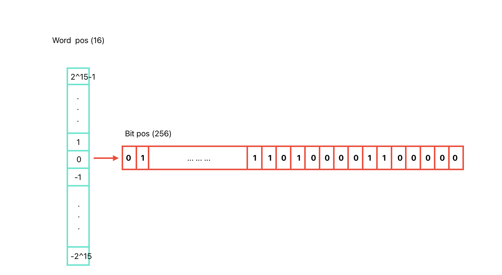
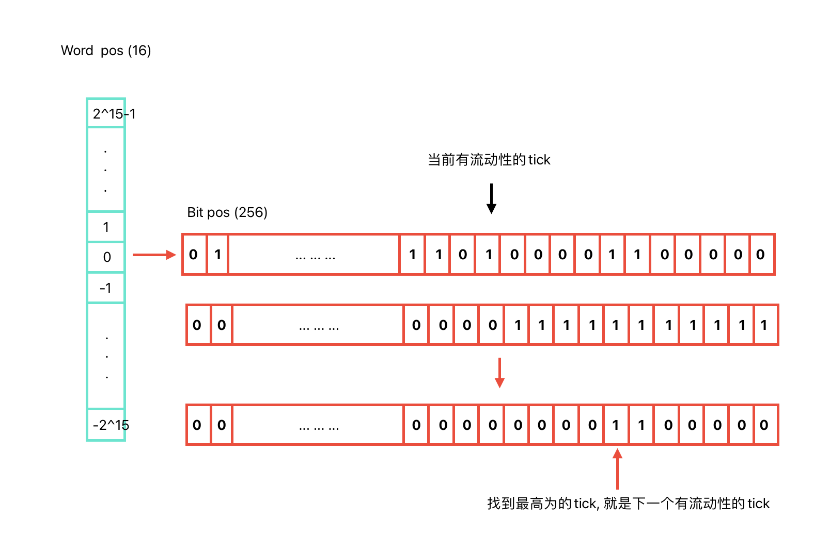
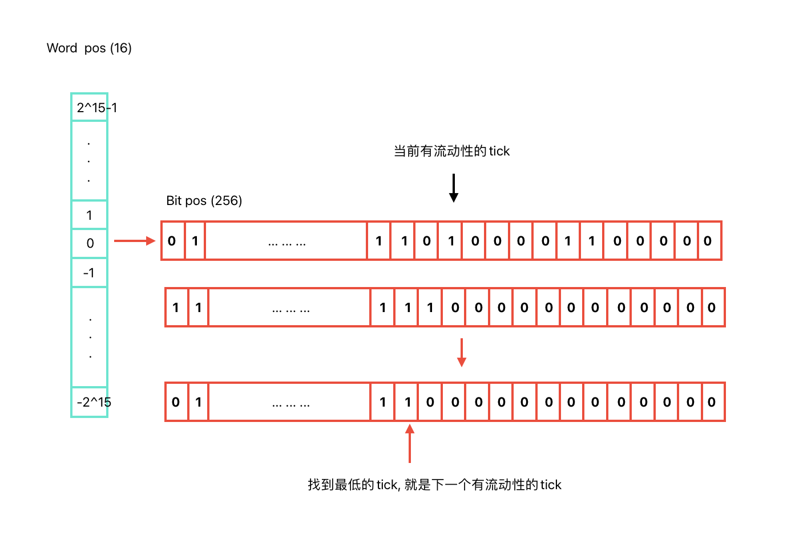

tick Bit Map 的设计与code 讲解
---

### 设计

为了方便的存储区间流动性 tick 所在点的 流动性状态信息, 以及快速的寻址的下一个区间流动性的tick, 同时也是为了减少gas 的消耗,而设计的tickBitMap


已知 $tick_{min} = -887272$ $tick_{min} = 887272$

tick bit map 设计了这样的一个结构 
mapping(int16 => uint256)
其中key(int16) 值 为 word pos, 
value (uint256) 值为 bit pos.


#### word pos & bit pos 公式
$word_{pos} = (tick/tickSpacing) / 256$
$bit_{pos} = 1 << ((tick/tickSpacing) \% 256) $

#### 矢量图


#### 如何寻找下一个 有流动性的 tick
* 当lte = true(向低位寻找下一个tick)


* 当lte = false(向高位寻找下一个tick)



### code 讲解
* position: 获取tick 的wordpost 和bitpos
```
function position(int24 tick) private pure returns (int16 wordPos, uint8 bitPos) {
    wordPos = int16(tick >> 8);
    bitPos = uint8(tick % 256);
}
```

* flipTick: 将指定的tick 的bit pos位.进行反转, 0->1, or 1->0
```
function flipTick(
    mapping(int16 => uint256) storage self,
    int24 tick,
    int24 tickSpacing
) internal {
    require(tick % tickSpacing == 0); // 确保tick 必须要是tickSpacing 的倍数.. 例如 tickSpacing = 10, 那么tick 应该是 -10,0,10,20...

    // tick / tickSpacing, 每次都是tickSpacing, 压缩离散点, 减少存储量
    (int16 wordPos, uint8 bitPos) = position(tick / tickSpacing);
    uint256 mask = 1 << bitPos;
    
    // 异或操作, 将mask位 进行反转
    self[wordPos] ^= mask;
}
```

* nextInitializedTickWithinOneWord: 查询当前bitpos 内下一个已经初始化的 tick, 没有则放回最后一个未初始化的tick
```
function nextInitializedTickWithinOneWord(
        mapping(int16 => uint256) storage self,
        int24 tick,
        int24 tickSpacing,
        bool lte
    ) internal view returns (int24 next, bool initialized) {
        int24 compressed = tick / tickSpacing; // 压缩tick, 要是tickSpacing 的倍数
        if (tick < 0 && tick % tickSpacing != 0) compressed--; // 如果tick 是负数,正好又不能整除,则需要compressed--

        if (lte) { // less than or equals
            // 向更低的tick
            (int16 wordPos, uint8 bitPos) = position(compressed);
            // all the 1s at or to the right of the current bitPos
            uint256 mask = (1 << bitPos) - 1 + (1 << bitPos); // 在bit pos 右边的所有bit 设置1, (bitPos,最低位]
            uint256 masked = self[wordPos] & mask; // 与操作, 

            // if there are no initialized ticks to the right of or at the current tick, return rightmost in the word
            initialized = masked != 0; // 确认是否有有流动性的tick
            // overflow/underflow is possible, but prevented externally by limiting both tickSpacing and tick

            // (compressed - bitPos) * tickSpcing = 当前的最后tick 
            // (compressed - bitPos + (有流动性的最高位)) * tickSpcing // 下一个有流动性的tick
            next = initialized
                ? (compressed - int24(bitPos - BitMath.mostSignificantBit(masked))) * tickSpacing // 有, 则获取 masked 最高位, 
                : (compressed - int24(bitPos)) * tickSpacing;
        } else {
             // 向更高的tick
            // start from the word of the next tick, since the current tick state doesn't matter

            // compressed + 1 是要向高位的方向查询, 这里因为 是> compressed 的方向查询,所以要compressed + 1
            // 跳过当前 tick，从下一个 tick 开始搜索
            (int16 wordPos, uint8 bitPos) = position(compressed + 1);
            // all the 1s at or to the left of the bitPos
            uint256 mask = ~((1 << bitPos) - 1); // 取反, 从 bitPos 到最高位的所有位为 1[bitPos,最高位]
            uint256 masked = self[wordPos] & mask; // 

            // if there are no initialized ticks to the left of the current tick, return leftmost in the word
            initialized = masked != 0;
            // overflow/underflow is possible, but prevented externally by limiting both tickSpacing and tick

            // (compressed + 1) * tickSpacing = 当前的tick
            // (compressed +1 +(256-bitpos)) * tickSpacing =  当前bitpos 之前剩余的都没有流动性, 当前word 的最高位所在的tick
            // (compressed + 1 + int24(BitMath.leastSignificantBit(masked) - bitPos)) * tickSpacing = 当前bitpos 向右偏移,多少是下一个tick
            next = initialized
                ? (compressed + 1 + int24(BitMath.leastSignificantBit(masked) - bitPos)) * tickSpacing
                : (compressed + 1 + int24(type(uint8).max - bitPos)) * tickSpacing;
        }
    }
```


