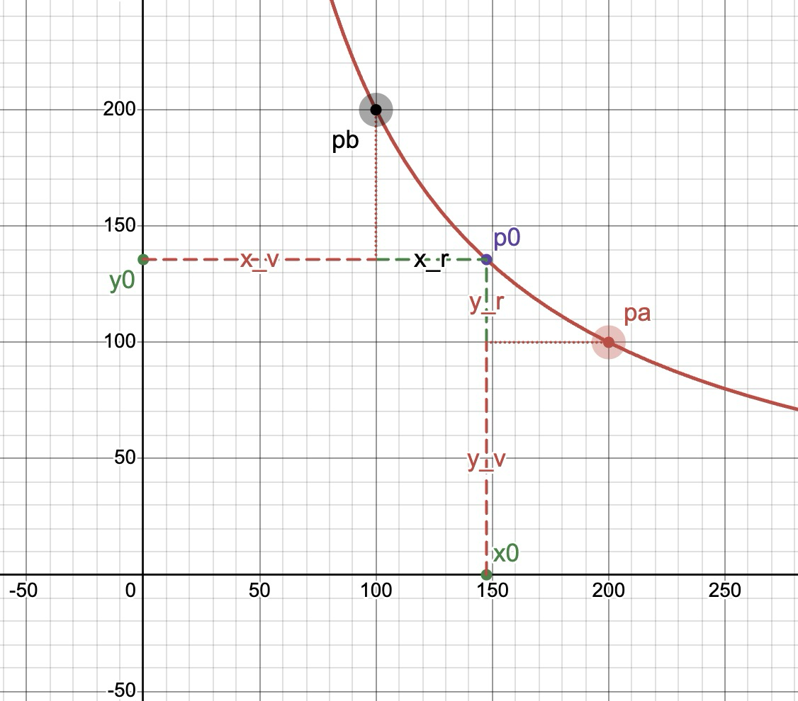
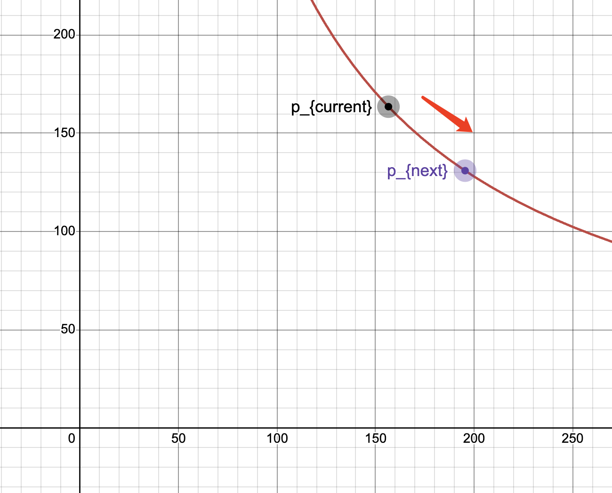
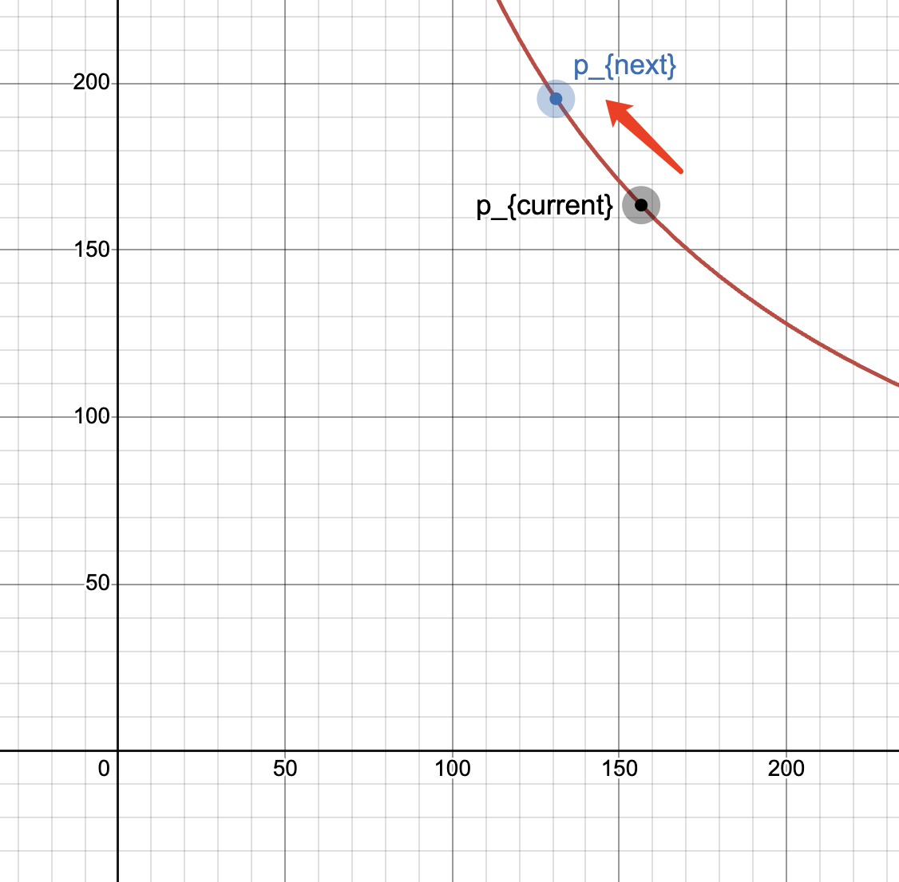
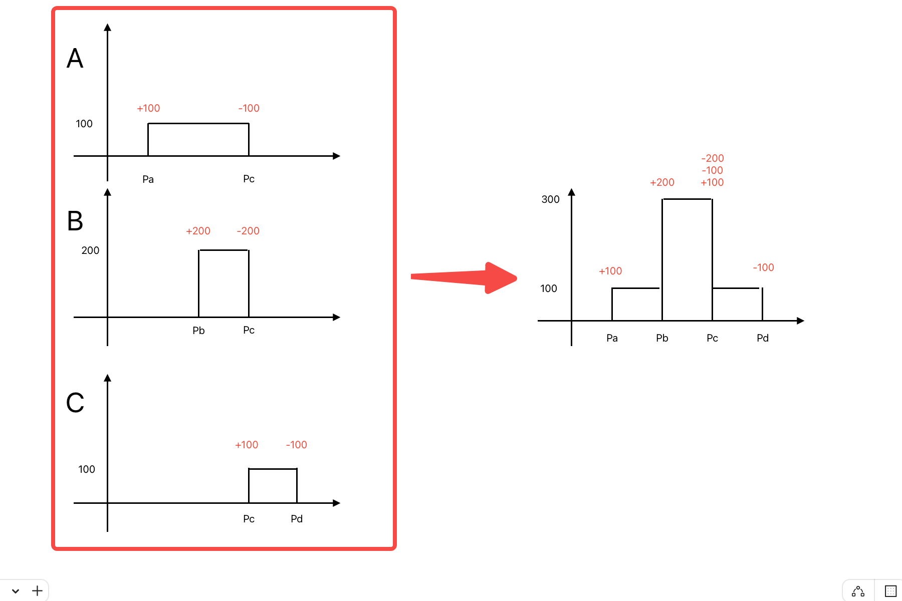

分析uniswap v3
---

### eth 合约地址
* `router` : `0xE592427A0AEce92De3Edee1F18E0157C05861564`
* `routerV2` : `0x68b3465833fb72A70ecDF485E0e4C7bD8665Fc45`
* `UniversalRouter` : `0x66a9893cc07d91d95644aedd05d03f95e1dba8af`
* `factory`: `0x1F98431c8aD98523631AE4a59f267346ea31F984`

### [核心算法](https://app.uniswap.org/whitepaper-v3.pdf)
    `Y 表示token0, X表示token1`

#### 关于uniswap v2价格的算法
* 与uniswap v2 本质上一样
    * $XY = L^2$ 
    * $P = \frac{Y}{X}$

* 求X、L、P 的关系
    $X = \frac{L^2}{Y}$
    $X = \frac{Y}{P}$
    => $X^2 = \frac{L^2}{Y} * \frac{Y}{P}$
    => $X^2 = \frac{L^2}{P}$
    => $\large X = \frac{L}{\sqrt{P}}$

* 求Y、L、P 的关系
    $Y = \frac{L^2}{X}$
    $Y = PX$
    => $Y^2 = \frac{L^2}{X}PX$
    => $Y^2 = L^2P$
    => $\large Y = L\sqrt{P}$ 

#### 集中流动性计算(和添加与撤销流动性有关的公式)
* 假设流动性集中在某一段价格之间($p_a$ ~ $p_b$) 
  `此处需要特别说明,uniswap v3 中价格都是一段一段计算的,所以这里要先了解,在单个集中流动性中的计算公式`
    $(X_v + X_r)(Y_v + Y_r) = L^2$
    * 当价格从$p_0$到$P_a$ 时,求$Y_v$ 关于$L$ 和 $P_a$ 的 公式为
        $Y_v = L\sqrt{P_a}$
    * 当价格从$p_0$到$P_b$ 时,求$X_v$ 关于$L$ 和 $P_b$ 的 公式为
        $X_v = \frac{L}{\sqrt{P_b}}$
    
    * 此时集中流动性的公式可以演变为
        $(\frac{L}{\sqrt{P_b}} + X_r)(L\sqrt{P_a} + Y_r) = L^2$
    
    * 此时我们如果知道$P_a$、$P_b$、$X_r$、$Y_r$、$L$、这些数据,就可以在这个价格区间内进行swap 操作了. 下面会介绍如何知道 $P$ 的数据


* 公式矢量图


#### 价格 $P$ 与tick 的关系

* 价格公式(uniswap v3 中用了这种方式来表示价格)
    $P = 1.0001^t$        
        
* t 的取值范围为 -887272 ~ 887272
    $t_{min}=\log_{1.0001}(2^-128)≈-887272$
    $t_{max}=\log_{1.0001}(2^128)≈887272$


#### 单个区间内的swap 兑换公式

* 用X 兑换Y

    $\Delta X = \frac{L}{\sqrt{P_{next}}} - \frac{L}{\sqrt{P_{current}}}$

    $\Delta Y = L\sqrt{P_{current}} - L\sqrt{P_{next}}$
    
    * 已知$\Delta X$ 求$P_{next}$ 

        => $\frac{L}{\sqrt{P_{next}}} = \Delta X + \frac{L}{\sqrt{P_{current}}}$

        => $\sqrt{P_{next}} = \frac{L}{\Delta X + \frac{L}{\sqrt{P_{current}}}}$
        
        => $\sqrt{P_{next}} = \frac{L}{\frac{\Delta X \sqrt{P_{curent}} + L}{\sqrt{P_{current}}}}$
        
        => $\sqrt{P_{next}} = \frac{L\sqrt{P_{curent}}}{\Delta X \sqrt{P_{curent}} + L}$
    
    * 代入 求$\Delta Y$

        => $\Delta Y = L(\sqrt{P_{current}} - \frac{L\sqrt{P_{curent}}}{\Delta X \sqrt{P_{curent}} + L})$

        =>$\Delta Y = L(\frac{\Delta X P_{curent}}{\Delta X \sqrt{P_{curent}} + L})$

        =>$\Delta Y = \frac{L\Delta X P_{curent}}{\Delta X \sqrt{P_{curent}} + L}$
    
    * 

* 用Y 兑换X

    $\Delta X = \frac{L}{\sqrt{P_{current}}} - \frac{L}{\sqrt{P_{next}}}$

    $\Delta Y = L\sqrt{P_{next}} - L\sqrt{P_{current}}$

    * 已知$\Delta Y$ 求$P_{next}$ 

        =>$L\sqrt{P_{next}}= L\sqrt{P_{current}} + \Delta Y$

        => $\sqrt{P_{next}} = \frac{L\sqrt{P_{current}} + \Delta Y}{L}$

        => $\sqrt{P_{next}} = \sqrt{P_{current}} + \frac{\Delta Y}{L}$
    
    * 代入 求$\Delta X$
        => $\Delta X = \frac{L}{\sqrt{P_{current}} + \frac{\Delta Y}{L}} - \frac{L}{\sqrt{P_{current}}}$

        => $\Delta X = \frac{L\sqrt{P_{current}} - L\sqrt{P_{current}} - \Delta Y}{\sqrt{P_{current}(\sqrt{P_{current}} - \frac{\Delta Y}{L})}}$

        => $\Delta X = \frac{-\Delta Y}{\sqrt{P_{current}(\sqrt{P_{current}} - \frac{\Delta Y}{L})}}$
    
    * 

* `SqrtPriceMath.sol` 如何得到$P_{next}$


### 区间流动性&跨流动性计算

#### 不同用户添加流动性
    ```
    A 用户从 [Pa,Pb] 处添加 100 流动性
    B 用户从 [Pb,Pc] 处添加 200 流动性
    C 用户从 [Pc,Pd] 处添加 100 流动性
    ```



#### 如何存储流动性呢?
    如上图所述,
    用户A 在[Pa,Pc] 处添加 100 流动性, 那么合约中需要 在 Pa 点做 +100 流动性的记录, 在Pc 点做-100 流动性的记录
    用户B 在[Pb,Pc] 处添加 200 流动性, 那么合约中需要 在 Pb 点做 +200 流动性的记录, 在Pc 点做-200 流动性的记录
    用户C 在[Pc,Pd] 处添加 100 流动性, 那么合约中需要 在 Pc 点做 +100 流动性的记录, 在Pd 点做-100 流动性的记录
    最后 当swap时,如果需要进入到下一个tick 时,只需要在下一个tick 处添加对应点的 流动性即可 (当前tick区间的 liquidity 时保存在合约中的)


#### [tickBitMap 的设计](./tickBitMap.md)

### 手续费计算
